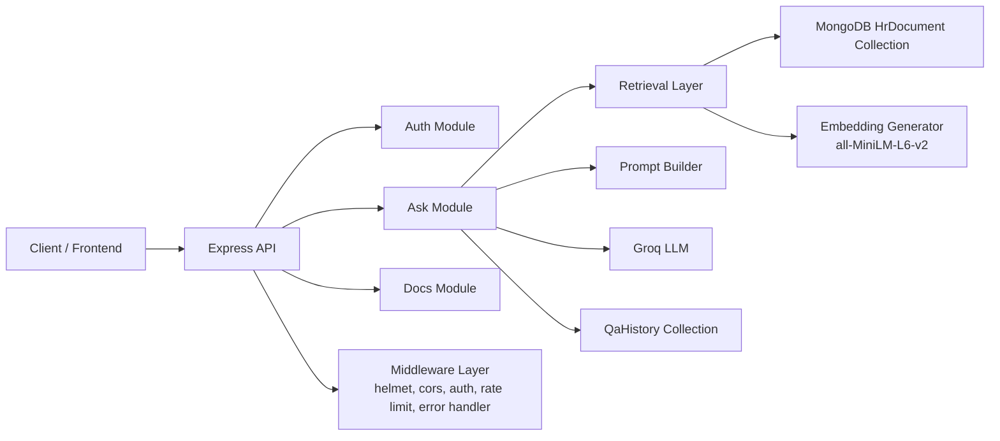
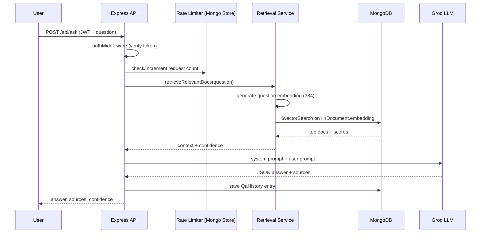
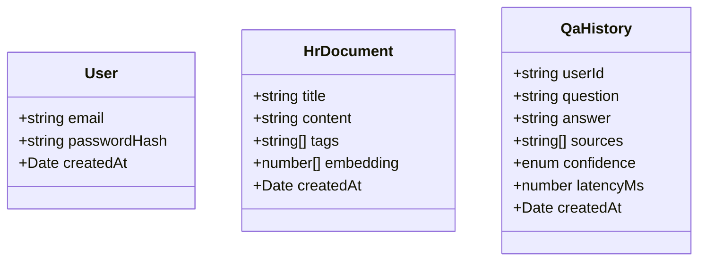

# Smart Q&A API - HR Knowledge Base (Assignment Project)

This project is a modular Node.js + TypeScript backend that answers HR policy questions using a Retrieval-Augmented Generation (RAG) pipeline.

It combines:
- authentication and protected APIs,
- MongoDB document storage and vector retrieval,
- local embedding generation,
- LLM-based answer generation,
- confidence scoring and request history tracking.

## What This Project Implements

- **JWT auth system** with register/login and protected routes.
- **RAG ask endpoint** (`/api/ask`) with:
  - semantic retrieval from HR documents,
  - confidence scoring (`high | medium | low`),
  - source attribution.
- **MongoDB Atlas vector search** using `$vectorSearch`.
- **Fallback retrieval** with in-app cosine similarity if vector search is unavailable.
- **Mongo-backed rate limiting** (`rate-limit-mongo`) on ask endpoint.
- **Structured logging** using `pino` and `pino-http`.
- **Global error handling** and response standardization.
- **Swagger/OpenAPI docs** at `/api-docs`.
- **Seed script** to load HR policy corpus and embeddings.
- **Integration tests** for ask/auth flow.
- **Docker support** for local containerized run.

## Tech Stack

- **Runtime:** Node.js, TypeScript, Express
- **Database:** MongoDB + Mongoose
- **Vector Retrieval:** MongoDB `$vectorSearch` + cosine fallback
- **Embeddings:** `@xenova/transformers` (`Xenova/all-MiniLM-L6-v2`, 384 dimensions)
- **LLM:** Groq-compatible endpoint via LangChain `ChatOpenAI`
- **Validation:** Zod
- **Security:** JWT, Helmet, CORS, Express Rate Limit + Mongo store
- **Observability:** Pino + pino-http
- **Testing:** Node test runner + Supertest

## High-Level Architecture



## Request Lifecycle



## Project Structure

```text
src/
  app.ts                        # Express app setup and route mounting
  server.ts                     # Entry point (env, DB connect, listen)
  db/
    connect.ts                  # Mongoose connection
  features/
    auth/
      auth.routes.ts            # /api/auth endpoints
      auth.controller.ts
      auth.service.ts
      auth.schema.ts
      user.model.ts
    ask/
      ask.routes.ts             # /api/ask endpoints
      ask.controller.ts
      ask.service.ts
      ask.schema.ts
      qa-history.model.ts
      ask.test.ts
    docs/
      docs.routes.ts            # /api/docs endpoint
      docs.controller.ts
      docs.service.ts
      document.model.ts
  middleware/
    auth.middleware.ts
    rate-limit.middleware.ts
    error.middleware.ts
  lib/
    embeddings.ts               # local embedding generation
    retrieval.ts                # vector search + confidence
    llm.ts                      # Groq LangChain wrapper
    prompts.ts                  # RAG prompt templates
    swagger.ts                  # OpenAPI config
    logger.ts
    api-response.ts
    api-error.ts
    async-handler.ts
  scripts/
    seed-documents.ts           # seeds 8 HR policy docs with embeddings
```

## Core Features Explained

### 1) Authentication and Authorization

- `POST /api/auth/register` creates a new user and returns JWT.
- `POST /api/auth/login` validates credentials and returns JWT.
- `authMiddleware` protects `/api/ask` and `/api/ask/history`.
- JWT payload includes `id` and `email`.

### 2) RAG Ask Pipeline

Implemented in `ask.service.ts` + `retrieval.ts`:

1. Validate question (`3..500` chars) using Zod.
2. Generate embedding for user query.
3. Retrieve top N relevant docs:
   - primary: MongoDB `$vectorSearch`,
   - fallback: in-app cosine similarity.
4. Compute confidence using top similarity score:
   - `>= 0.75` -> `high`
   - `>= 0.45` -> `medium`
   - else -> `low`
5. Build context-rich prompt and call Groq LLM.
6. Parse strict JSON response.
7. Save answer and metadata in `QaHistory`.

### 3) Vector Search (MongoDB Atlas)

`retrieveRelevantDocs()` uses:
- index name from `MONGODB_VECTOR_INDEX_NAME`,
- vector field `embedding`,
- query vector from local embedding model.

If Atlas vector search is unavailable/misconfigured, the code automatically falls back to local cosine scoring over stored embeddings.

### 4) Rate Limiting

- Uses `express-rate-limit` + `rate-limit-mongo`.
- Configured as `10 requests / minute` for ask endpoint.
- Keyed by authenticated user id (fallback: IP).
- Stored in MongoDB collection `rateLimitRecords`.

### 5) Logging and Error Handling

- Request/response logs via `pino-http`.
- Operational logs via `pino`.
- Confidence/retrieval diagnostics via console logs in retrieval/ask services.
- Global `errorHandler` returns structured JSON errors.

### 6) API Documentation

- Swagger/OpenAPI generated from JSDoc and schemas.
- UI available at:
  - `GET /api-docs`

## Data Model Overview



## API Endpoints

### Auth

- `POST /api/auth/register`
- `POST /api/auth/login`

### Documents

- `GET /api/docs`

### Ask

- `POST /api/ask` (JWT required, rate-limited)
- `GET /api/ask/history` (JWT required)

## Environment Variables

Create `.env` from `.env.example` and add:

- `PORT` (default in code if unset: `3000`)
- `MONGODB_URI` (MongoDB connection string)
- `JWT_SECRET`
- `JWT_EXPIRES_IN`
- `GROQ_API`
- `MONGODB_VECTOR_INDEX_NAME` (for Atlas vector index, e.g. `vector_index`)
- `NODE_ENV` (optional, impacts error stack visibility)

## Setup and Run

```bash
# 1) Install dependencies
npm install

# 2) Configure env
cp .env.example .env
# Fill required values in .env

# 3) Seed HR documents + embeddings
npm run seed

# 4) Start dev server
npm run dev

# 5) Open Swagger docs
# http://localhost:5000/api-docs (if PORT=5000)
```

## MongoDB Atlas Vector Index Setup

Create a Vector Search index on your HR document collection:

- **Index name:** same as `MONGODB_VECTOR_INDEX_NAME` (example: `vector_index`)
- **Path:** `embedding`
- **Dimensions:** `384`
- **Similarity:** `cosine`

Example definition:

```json
{
  "fields": [
    {
      "type": "vector",
      "path": "embedding",
      "numDimensions": 384,
      "similarity": "cosine"
    }
  ]
}
```

## Testing

Run all tests:

```bash
npm test
```

Current tests are integration-focused (`src/features/ask/ask.test.ts`) using mocked embedding and LLM calls.

## Docker

```bash
docker-compose up --build
```

This starts:
- MongoDB container
- App container (builds TypeScript and runs server)

## Assignment Deliverables Covered

- Modular backend architecture (`features`, `lib`, `middleware`, `scripts`)
- JWT auth and protected resource access
- RAG answer pipeline with source grounding
- Confidence scoring system
- MongoDB vector search integration
- Mongo-backed rate limiting
- Swagger API documentation
- Integration testing
- Seeded HR knowledge corpus
- Operational logging and centralized error handling

## Notes / Known Caveats

- `/api/docs` is currently public.
- Verbose confidence logs are enabled (useful for demo/debug).
- Swagger server URL is fixed to localhost in current config.
- Seed script clears existing `HrDocument` data before insert.

## Quick Demo Flow

1. Register user via `/api/auth/register`.
2. Copy returned JWT.
3. Ask question on `/api/ask` with `Authorization: Bearer <token>`.
4. Check response with `answer`, `sources`, `confidence`.
5. Verify history at `/api/ask/history`.
